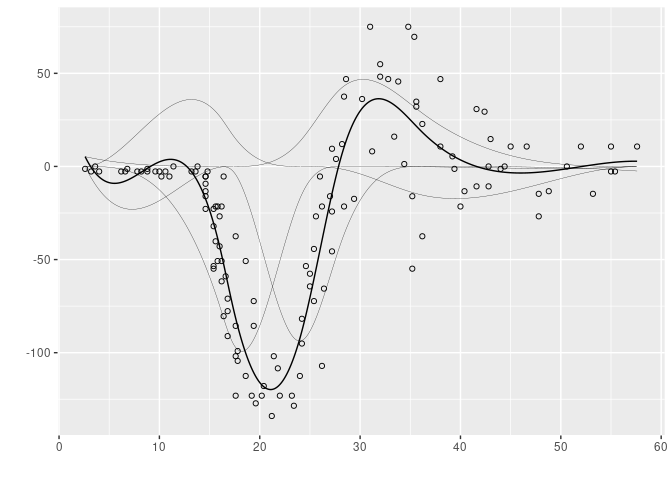
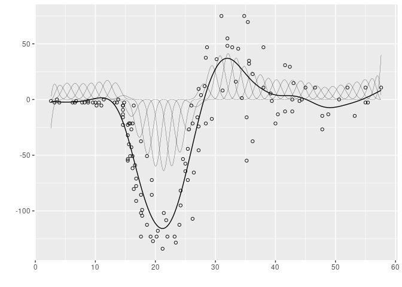

<!-- README.md is generated from README.Rmd. Please edit that file -->

# aspline

<!-- badges: start -->

[](https://github.com/goepp/aspline/actions)
<!-- badges: end -->

## What are Adaptive Splines?

This package implements [A-Spline](https://arxiv.org/abs/1808.01770)
regression, an adaptive procedure for fitting splines with automatic
selection of the knots. One-dimentional B-Splines of any non-negative
degree can be fitted. This method uses a penalization approach to
compensate overfitting. The penalty is proportional to the number of
knots used to support the regression spline. Consequently, the fitted
splines will have knots only where necessary and the fitted model is
sparser than comparable penalized spline regressions (for instance the
standard method for penalized splines:
[P-splines](https://doi.org/10.1214/ss/1038425655)).

## Installation

You can install the development version from
[GitHub](https://github.com/) with:

``` r
# install.packages("devtools")
devtools::install_github("goepp/aspline")
```

## Example

Below is an illustration of the A-spline procedure using the
[helmet](https://github.com/goepp/aspline/blob/master/data/helmet.rda)
data. The thick line represents the fitted spline and the thin line
represents the B-spline basis decomposition of the fitted curve.

``` r
library(aspline)
library(tidyverse)
#> ── Attaching packages ─────────────────────────────────────── tidyverse 1.3.1 ──
#> ✓ ggplot2 3.3.3     ✓ purrr   0.3.4
#> ✓ tibble  3.1.2     ✓ dplyr   1.0.5
#> ✓ tidyr   1.1.3     ✓ stringr 1.4.0
#> ✓ readr   1.4.0     ✓ forcats 0.5.1
#> ── Conflicts ────────────────────────────────────────── tidyverse_conflicts() ──
#> x dplyr::filter() masks stats::filter()
#> x dplyr::lag()    masks stats::lag()
library(splines2)
data(helmet)
x <- helmet$x
y <- helmet$y
k <- 40
knots <- seq(min(x), max(x), length = k + 2)[-c(1, k + 2)]
degree <- 3
pen <- 10 ^ seq(-4, 4, 0.25)
x_seq <- seq(min(x), max(x), length = 1000)
aridge <- aspline(x, y, knots, pen, degree = degree)
#> Warning: `data_frame()` was deprecated in tibble 1.1.0.
#> Please use `tibble()` instead.
a_fit <- lm(y ~ bSpline(x, knots = aridge$knots_sel[[which.min(aridge$ebic)]],
                        degree = degree))
X_seq <- bSpline(x_seq, knots = aridge$knots_sel[[which.min(aridge$ebic)]], 
                 intercept = TRUE, degree = degree)
a_basis <- (X_seq %*% diag(coef(a_fit))) %>%
  as.data.frame() %>%
  mutate(x = x_seq) %>%
  reshape2::melt(id.vars = "x", variable.name = "spline_n", value.name = "y") %>%
  as_tibble() %>%
  filter(y != 0)
a_predict <- data_frame(x = x_seq, pred = predict(a_fit, data.frame(x = x_seq)))
ggplot() +
  geom_point(data = helmet, aes(x, y), shape = 1) +
  geom_line(data = a_predict, aes(x, pred), size = 0.5) +
  geom_line(data = a_basis, aes(x, y, group = spline_n), linetype = 1, size = 0.1) +
  theme(legend.position = "none") +
  ylab("") +
  xlab("")
```



For the sake of comparision, we display here the estimated P-spline with
the same data. The thin lines also represent the B-spline basis
decomposition.

``` r
p_fit <- mgcv::gam(y ~ s(x, bs = "ps", k = length(knots) + 3 + 1, m = c(3, 2)))
X <- bSpline(x_seq, knots = knots, intercept = TRUE)
p_basis <- (X %*% diag(coef(p_fit))) %>%
  as.data.frame() %>%
  mutate(x = x_seq) %>%
  reshape2::melt(id.vars = "x", variable.name = "spline_n", value.name = "y") %>%
  as_tibble() %>%
  filter(y != 0)
p_predict <- data_frame(x = x_seq, pred = predict(p_fit, data.frame(x = x_seq)))
ggplot() +
  geom_point(data = helmet, aes(x, y), shape = 1) +
  geom_line(data = p_predict, aes(x, pred), size = 0.5) +
  geom_line(data = p_basis, aes(x, y, group = spline_n), linetype = 1, size = 0.1) +
  theme(legend.position = "none") +
  ylab("") + xlab("")
```



## Contact

If you encounter a bug or have a suggestion for improvement, please
[raise an issue](https://github.com/goepp/aspline/issues/new) or make a
pull request.

## License

This package is released under the GPLv3 License: see the `LICENSE` file
or the [online text](https://www.gnu.org/licenses/gpl-3.0.en.html). In
[short](https://tldrlegal.com/license/gnu-general-public-license-v3-\(gpl-3\)#summary),
you can use, modify, and distribute (including for commerical use) this
package, with the notable obligations to use the GPLv3 license for your
work and to provide a copy of the present source code.
